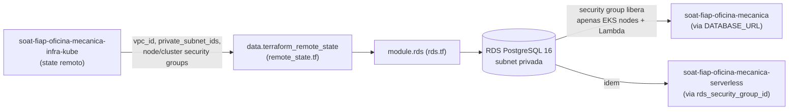

# soat-fiap-oficina-mecanica-infra-data

Infraestrutura como código (Terraform) para os recursos de dados (banco de dados gerenciado)
da oficina mecânica.

## Arquitetura deste repositório



## O que este repositório provisiona

- **RDS PostgreSQL 16** (`aws_db_instance`), em subnets privadas, criptografado em repouso.
- **Security group** do RDS, liberando a porta `5432` **apenas** para os worker nodes do
  cluster EKS — o banco não é acessível pela internet.
- **Subnet group** e **parameter group** dedicados.

A VPC e o cluster EKS **não** são provisionados aqui — eles vêm do repositório
[`soat-fiap-oficina-mecanica-infra-kube`](https://github.com/arodri19/soat-fiap-oficina-mecanica-infra-kube),
lidos via `terraform_remote_state` (`remote_state.tf`). Isso evita duplicar o provisionamento
da rede e mantém os dois repositórios com responsabilidades separadas, como pede a Fase 3.

## Uso

```bash
cp terraform.tfvars.example terraform.tfvars
# edite terraform.tfvars — especialmente tf_state_bucket, que deve apontar para o mesmo
# bucket S3 usado como backend pelo repositório infra-kube

export TF_VAR_db_password="defina-uma-senha-forte"

terraform init \
  -backend-config="bucket=<TF_STATE_BUCKET>" \
  -backend-config="key=oficina-mecanica/infra-data/terraform.tfstate" \
  -backend-config="region=us-east-1" \
  -backend-config="dynamodb_table=<TF_STATE_LOCK_TABLE>" \
  -backend-config="encrypt=true"

terraform plan
terraform apply
```

Pré-requisito: o `apply` do repositório `infra-kube` já deve ter rodado antes (é dele que
vêm `vpc_id`, `private_subnet_ids` e os security groups do EKS).

## Depois do apply

Use o output `db_secret_patch_command` para atualizar o `Secret` do Kubernetes
(`oficina-secrets`, no repositório da aplicação principal) com o endpoint real do RDS.
